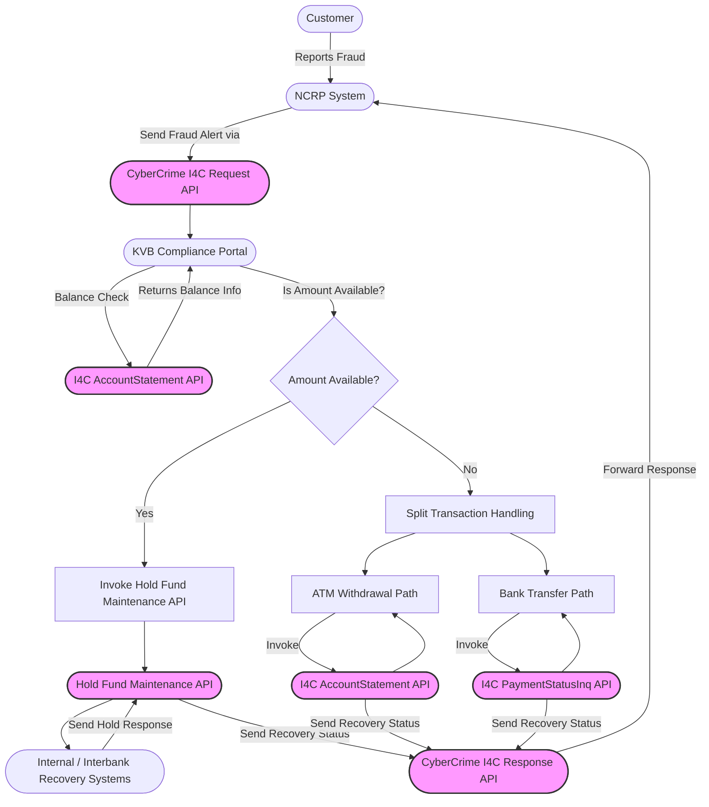
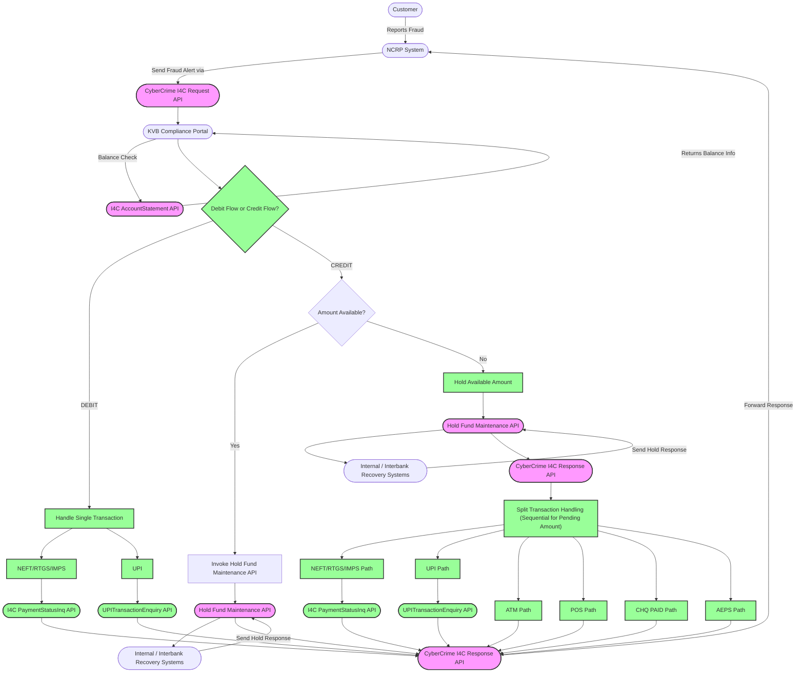
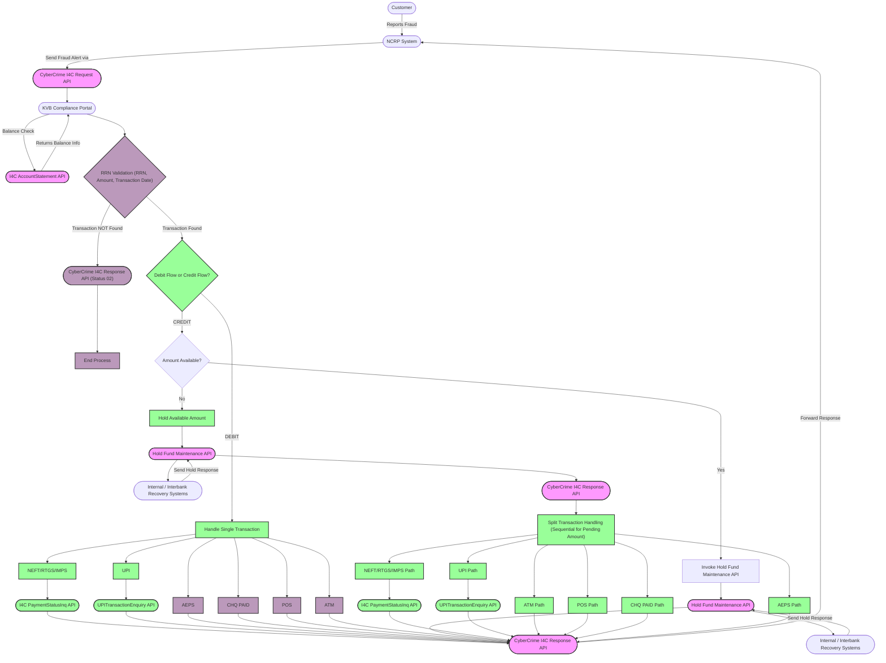

# Efforts

1. 21-Jul-25 : 25-Jul-25
* Server Setup
2. 28-Jul-25 : 01-Aug-25
* Initial Requirement
3. 04-Aug-25 : 08-Aug-25
* Updated Requirement
4. 11-Aug-25 : 15-Aug-25
* Latest Enhanced Requirement
5. 19-Aug-25 : 23-Aug-25
* DB Transactions
* Entries for Internet Banking, Vishing, Demat, UPI, Credit Card
6. 25-Aug-25 : 29-Aug-25
* Auto Response
* RES check against acknowledgement_no in i4c_request
* Invalid RRN / Statement Unavailable handling
* POS string check handling
* Email & Phone from API
7. 01-Sep-25 : 05-Sep-25
* Branch code and Branch number to be taken from db
* Bank master to be taken from db
* Separate log files for each Job
* I4C Response table must also have request
* Separate table to store all actions being taken
    - RRN Validation
    - Balance Check
    - Hold Funds
    - Money Transfer
    - Money Withdrawal
* Any other handling
* Go Live

# Initial Requirement

# Updated Requirement

# Latest Enhanced Requirement

